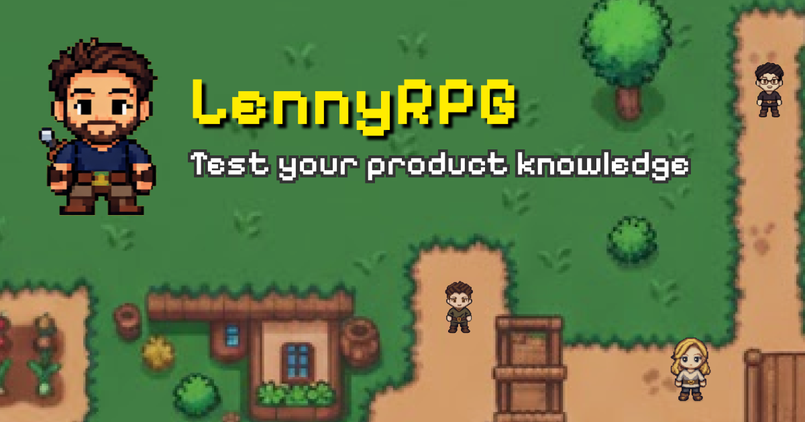

# 🎮 LennyRPG - Test Your Product Knowledge

[](https://www.lennyrpg.fun/)
[](https://www.lennysnewsletter.com/podcast)

**A retro-style RPG game featuring 283 legendary guests from [Lenny's Podcast](https://www.lennysnewsletter.com/podcast)** by Lenny Rachitsky.

Battle through product leaders, designers, and founders from companies like Airbnb, Stripe, Figma, and more. Answer challenging questions about product management, growth, and building great products. Level up your PM skills while having fun!



---

## 🎯 About

LennyRPG transforms Lenny Rachitsky's incredible podcast guest lineup into an epic adventure. Each guest becomes a capturable character with questions based on their expertise and insights from their podcast episodes.

Think Pokemon meets Product Management - a fun, educational way to test and improve your PM knowledge!

## ✨ Features

- 🎯 **283 Legendary Guests** - Battle product leaders from top tech companies
- 📚 **Product Knowledge Quiz** - Test yourself on PM frameworks, growth strategies, and startup wisdom
- 🎮 **Retro RPG Gameplay** - Pokemon-inspired mechanics with modern web technology
- 📈 **Global Leaderboard** - Compete with product enthusiasts worldwide using Supabase
- 🗺️ **Progressive Difficulty** - 29 maps with escalating challenges
- 💯 **Perfect Kill Bonuses** - Earn extra XP and HP for flawless battles (3/3 correct answers)
- 🎁 **Bonus Questions** - 5% chance for bonus XP and healing rewards
- ⚡ **Session Tracking** - Your progress updates in real-time on the leaderboard
- 🎨 **Pixel Art Aesthetic** - Retro visuals with smooth animations

## 🎲 Game Rules

### Battle Mechanics
- **Max HP**: 100
- **Wrong Answer Penalty**: -10 HP
- **Game Over**: HP ≤ 0 (restart from beginning)
- **Questions per Battle**: 3 questions per guest

### XP & Leveling
- **XP per Correct Answer**: Scales with level (10-50 XP)
- **XP to Level Up**: 24 × XP per correct answer
- **Level Cap**: 29 levels (one per map)

### Special Rewards
- **Perfect Kill (3/3 correct)**:
  - Double XP (6× base XP)
  - +20 HP healing
- **Bonus Question (5% chance)**:
  - +2× XP if answered correctly
  - +10 HP healing
  - Stacks with Perfect Kill for huge rewards!

## 🚀 Play Now

🎯 **[www.lennyrpg.fun](https://www.lennyrpg.fun/)**

No installation required - play directly in your browser!

## 🛠️ Tech Stack

Built with modern web technologies for optimal performance:

- **Game Engine**: [Phaser 3.90.0](https://phaser.io) - HTML5 game framework
- **Frontend**: [Vue 3.5.13](https://vuejs.org/) - Progressive JavaScript framework
- **Build Tool**: [Vite 6.3.1](https://vitejs.dev/) - Next generation frontend tooling
- **Database**: [Supabase](https://supabase.com/) - Open source Firebase alternative
- **Icons**: [Iconify](https://iconify.design/) - Universal icon framework
- **Styling**: Press Start 2P font for authentic retro aesthetics

## 💻 Development

### Prerequisites

- [Node.js](https://nodejs.org) (v16 or higher)
- npm or yarn

### Installation

```bash
# Clone the repository
git clone https://github.com/yourusername/lennyrpg.git
cd lennyrpg

# Install dependencies
npm install
```

### Available Commands

| Command | Description |
|---------|-------------|
| `npm run dev` | Launch development server at `http://localhost:8080` |
| `npm run build` | Create production build in `dist/` folder |

### Project Structure

```
lennyrpg/
├── public/              # Static assets
│   ├── assets/          # Game sprites, audio, images
│   ├── OpenGraph.png    # Social sharing image
│   ├── robots.txt       # SEO crawling rules
│   ├── sitemap.xml      # Site structure for search engines
│   └── manifest.json    # PWA configuration
├── src/
│   ├── components/      # Vue components
│   │   ├── BattleScreen.vue
│   │   ├── LeaderboardPanel.vue
│   │   └── ...
│   ├── game/            # Phaser game code
│   │   ├── scenes/      # Game scenes (MainMenu, Overworld, etc.)
│   │   ├── GuestData.js # 283 podcast guest data
│   │   └── EventBus.js  # Vue ↔ Phaser communication
│   ├── services/        # API services (Supabase)
│   ├── App.vue          # Root Vue component
│   └── main.js          # Application entry point
├── index.html           # HTML entry with SEO meta tags
└── package.json         # Dependencies and scripts
```

### Development Workflow

1. **Run the dev server**: `npm run dev`
2. **Edit files** in `src/` - Vite will hot-reload automatically
3. **Test changes** in your browser at `http://localhost:8080`
4. **Build for production**: `npm run build`
5. **Deploy** the `dist/` folder to your hosting service

## 🎨 Content

### Guest Data
All 283 podcast guests are stored in `src/game/GuestData.js` with:
- Guest name and title
- Company/background
- Avatar image
- Episode URL
- Trivia questions with answers and explanations

### Question Format
Each guest has 10 multiple-choice questions covering:
- Product management frameworks
- Growth strategies
- Career advice
- Company-building insights
- Lessons from their podcast episode

## 📊 Leaderboard

The global leaderboard uses Supabase for real-time updates:
- Session-based tracking (one entry per game session)
- Auto-updates after each battle
- Displays: Level, XP, Captured guests, Accuracy, Correct/Wrong answers
- Visual highlighting for your current session

## 🔗 Links

- 🎯 **Play Game**: [www.lennyrpg.fun](https://www.lennyrpg.fun/)
- 🎙️ **Lenny's Podcast**: [lennysnewsletter.com/podcast](https://www.lennysnewsletter.com/podcast)
- 💼 **Creator**: [Ben Shih](https://benshih.design/) | [LinkedIn](https://linkedin.com/in/hbshih)

## 🙏 Credits

### Created By
**[Ben Shih](https://benshih.design/)** - Game design, development, and implementation

### Content Source
**[Lenny Rachitsky](https://www.lennysnewsletter.com/)** - Original podcast content and guest insights from [Lenny's Podcast](https://www.lennysnewsletter.com/podcast)

### Built With
- [Phaser](https://phaser.io) - Game engine
- [Vue.js](https://vuejs.org/) - Frontend framework
- [Supabase](https://supabase.com/) - Database and authentication

## 📜 License

This project is a fan-made educational game based on public podcast content. All guest names, titles, and podcast references belong to their respective owners.

Game code and implementation © 2026 Ben Shih. All rights reserved.

---

**Made with ❤️ for the product management community**

Share your high score: [#LennyRPG](https://twitter.com/intent/tweet?text=I%20just%20played%20LennyRPG!%20Test%20your%20product%20knowledge%20at%20https://www.lennyrpg.fun)
